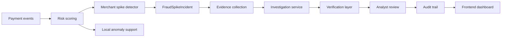

# FraudSpike AI architecture

## Overview

FraudSpike AI is a local fraud-operations demo built around a simple but credible workflow: detect suspicious merchant behavior, turn it into an incident, investigate the evidence, and keep the analyst in the loop. The system is intentionally scoped to be transparent about what is real, what is local, and what remains a human decision.

## Design principles

- keep the fraud detector authoritative and deterministic
- separate evidence-backed investigation from model-like assistance
- keep the workflow auditable and reviewable
- avoid pretending the demo is a production payment processor
- retain a clean boundary between frontend presentation, backend logic, and persistence

## High-level system flow

## Backend responsibilities

The backend owns the application logic that matters operationally:

- ingesting and validating payment events
- scoring transactions and merchants
- detecting merchant-level fraud spikes
- persisting incidents and investigations
- building evidence-backed investigation summaries
- generating verification results against structured evidence
- recording audit events for decisions and state changes

The backend uses FastAPI and SQLite for the local demo environment, with strongly typed Pydantic models in the schema layer.

## Frontend responsibilities

The frontend is responsible for presentation and analyst workflows only:

- dashboard metrics
- merchant risk view
- incident list and detail views
- investigation workstation
- audit trail views
- evaluation summaries
- analyst action entry and status display

It does not own the decision engine and does not manage production payment credentials or external systems directly.

## Core domain objects

The working implementation includes the following contracts:

- PaymentEvent: a normalized payment record with time, amount, currency, method, status, customer and device references, geography, fraud label, and extensible metadata
- FraudLabel: legitimate, fraudulent, and unknown
- FraudSpikeIncident: merchant-level incident with risk, severity, status, baseline/observed rate, and analysis window
- EvidenceItem: structured evidence with category, metric, baseline comparison, timestamps, and supporting event references
- Investigation: structured investigation output with hypotheses, evidence references, explanation, and recommended defensive action
- EvaluationResult: held-out evaluation record with nullable metrics until evaluation runs
- AuditEvent: immutable system or analyst action record for traceability

## Risk and detection flow

The merchant spike detector compares observed fraud behavior against a baseline and highlights meaningful deviations. The logic is intentionally deterministic and explainable rather than a black-box model.

The risk engine and detector remain the primary signal path. The local anomaly component is supplementary and only used when there is enough evidence to support a lightweight, local ML signal.

## Investigation and verification flow

The investigation layer builds a structured finding using persisted incident evidence. It does not invent findings or silently fabricate monitoring text. Verification is a separate step that checks whether the investigation's claims are actually supported by evidence.

This is a key trust boundary: the investigation answer is constrained by evidence, not by a generalized generative narrative.

## Response and audit flow

Response actions remain bounded and defensive. They are recorded for accountability and use the existing audit trail rather than performing uncontrolled payment operations.

Every incident and investigation lifecycle change is traceable through the audit flow.

## Persistence

The repository uses a local SQLite-backed persistence layer for the demo environment. It stores:

- incidents
- investigations
- evidence metadata
- audit rows
- local state changes

No secrets, API keys, or credentials are stored in the domain models or persisted records.

## Safety and trust boundaries

- frontend: presentation layer only
- backend: authoritative logic and persistence
- local anomaly support: supplementary only
- external AI/LLM integrations: optional and not required for the core flow
- Razorpay: demo/test mode only and clearly separated from the core domain model

## Current scope

This project is a credible local fraud investigation demo. It is not a real payment processor, not a production threat platform, and not a live monitoring system connected to real payment rails.
