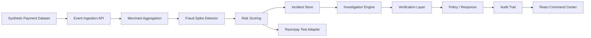

# FraudSpike AI architecture

## System boundary

The working system is a backend-authoritative merchant-risk platform. The frontend is presentation-only and does not access payment credentials or external model services directly.

## Frontend / backend flow

- The browser calls relative API paths such as `/api/health`, `/api/dashboard/summary`, `/api/incidents`, and `/api/evaluation`.
- The React frontend renders the dashboard, merchant intelligence, investigation workstation, evaluation center, and audit views.
- The FastAPI backend owns the detector, evaluation, incident lifecycle, investigation, verification, and audit functions.
- SQLite is the local persistence layer for the demo environment.

## Core domains

The current implementation includes:

- `PaymentEvent`: event-level payment record with merchant, timestamp, amount, fraud label, and metadata.
- `FraudSpikeIncident`: merchant-level incident with baseline, observed fraud rate, severity, status, and detector metadata.
- `Investigation`: structured explanation and hypotheses for a flagged merchant.
- `VerificationResult`: supported vs unsupported claims and evidence references.
- `AuditEvent`: append-only lifecycle and analyst action events.

## Detection flow

The detector operates at merchant level. It compares each merchant's observed fraud rate and event pattern to baseline behavior and produces a spike signal when the deviation crosses the configured anomaly threshold. Each merchant-spike is converted into an incident with a status, severity, and timestamp.

## Evaluation flow

The evaluation service computes confusion-matrix-based outcomes from the held-out test set. The app exposes the live numbers through the backend API and the UI reads them directly. It intentionally reports the real precision/recall trade-off and the false-positive cost instead of hiding it.

## Investigation and verification flow

The investigation layer consumes structured evidence and creates a concise explanation with hypotheses and recommended defensive response. The verification layer checks whether each claim is supported by the available evidence and distinguishes it clearly from unsupported claims.

## Response and audit flow

Response actions are bounded and defensive-only. They operate as policy events rather than unrestricted financial control. Every lifecycle or analyst action is persisted to the audit trail so the incident history remains reviewable.

## Safety and trust boundaries

- Frontend: presentation only, no secret material, no direct LLM access, no direct payment credentials.
- Backend: authoritative business logic, detector, evaluation, investigation, verification, action policy, audit persistence.
- AI/investigation: optional and evidence-grounded; no unrestricted action authority.
- Razorpay: demo/test mode only unless explicit credentials are configured and verified.

## Persistence

The current local app stores incidents, investigations, and audit events in SQLite. This is suitable for the local demo and keeps the risk workflow fully traceable.

## Current implementation footprint

The live local system includes:

- dashboard
- merchant intelligence
- incident center
- investigation workstation
- evaluation center
- audit trail
- system status
- synthetic/demo mode labeling
- backend-driven API data layer
- real reportable metrics

This repository reflects the actual working product, not an earlier scaffold.
